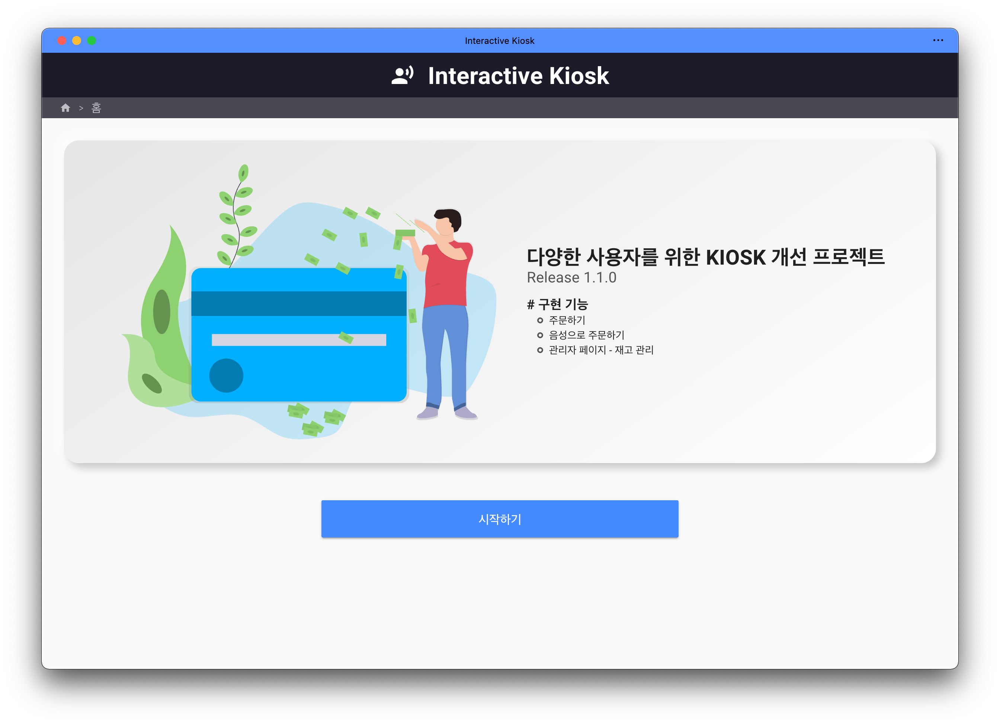

# Interactive Kiosk

1. [**소개**](#소개)
2. [**기술 스택**](#기술-스택)
3. [**기능 소개**](#기능-소개)
4. [**구경하기**](#구경하기)
5. [**설치하기**](#설치하기)
6. [**개발하기**](#개발하기)
7. [**빌드하기**](#빌드하기)
8. [**기여하기**](#기여하기)

## 소개

> Interactive Kiosk는 다양한 사용자를 위한 키오스크 개선 프로젝트입니다.

> 핵심 기능인 ‘음성으로 주문하기’는 STT를 활용하여 사용자의 음성을 텍스트로 변환하고, 자체 구현한 정규표현식으로 구문을 분석하는 과정을 거친 후, TTS를 통해 음성 피드백을 제공합니다.
> 또한 PWA와 Electron을 활용하여 스마트폰 뿐만 아니라, 다양한 환경에서도 작동할 수 있도록 했습니다.

> KB국민은행 소프트웨어 경진대회 특별상 수상

- [Documentation](https://drive.google.com/file/d/16DlM1dd20kCKLaFSR_IQXlBWSuw54SIi/preview)

## 기술 스택

- STT: Clova Speech Recognition - © NAVER Cloud Corp.
- TTS: Vocalware - © Oddcast Inc.

## 기능 소개

- **주문하기**: 웹 환경에서 주문하기
- **음성으로 주문하기** (Electron 전용): STT + TTS로 주문하기
- **관리자**: 재고 관리, 키오스크 종료 등의 관리자 전용 메뉴

## 구경하기

- [https://kiosk.hyunwoo.dev](https://kiosk.hyunwoo.dev)
- '음성으로 주문하기' 기능은 Electron 버전에서만 작동해요.

## 설치하기

- `npm i`

## 개발하기

- `npm run serve`

## 빌드하기

- `npm build`

## 기여하기

- [Issues](https://github.com/circlesapp/circles/issues)
